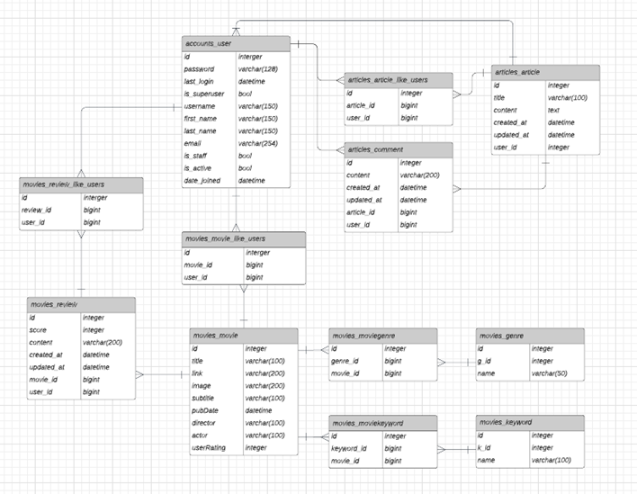
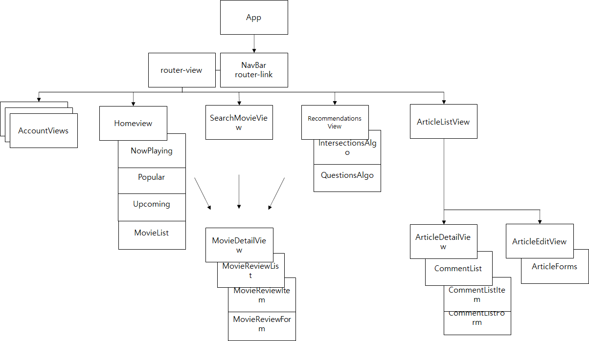
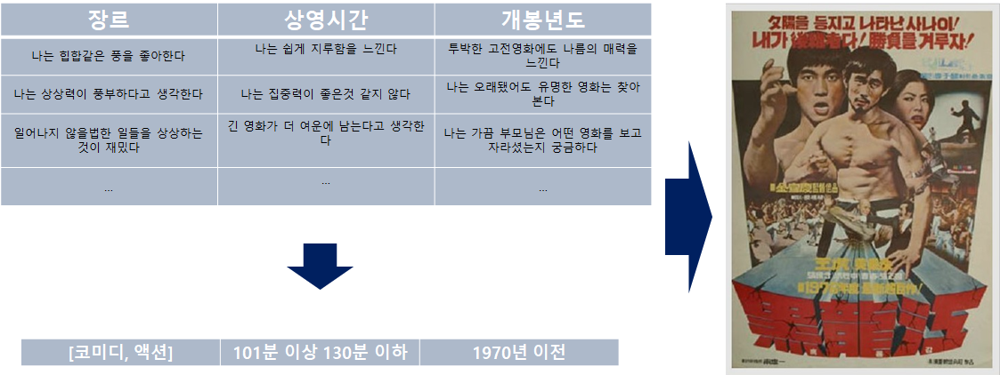
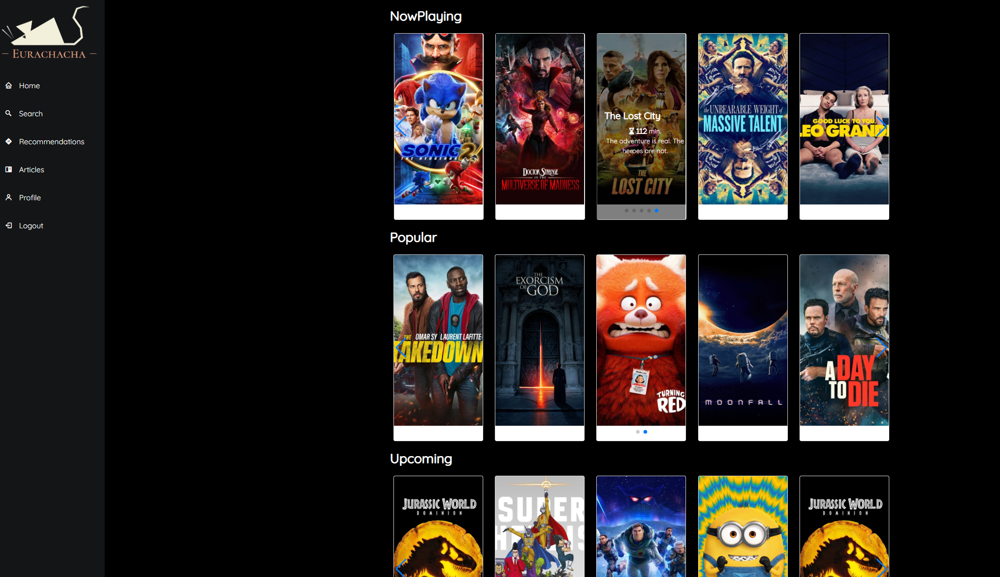
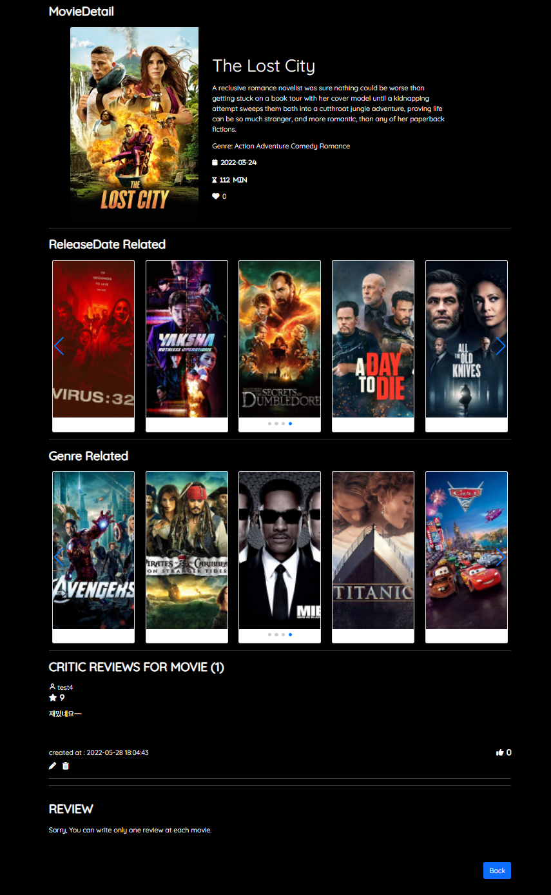
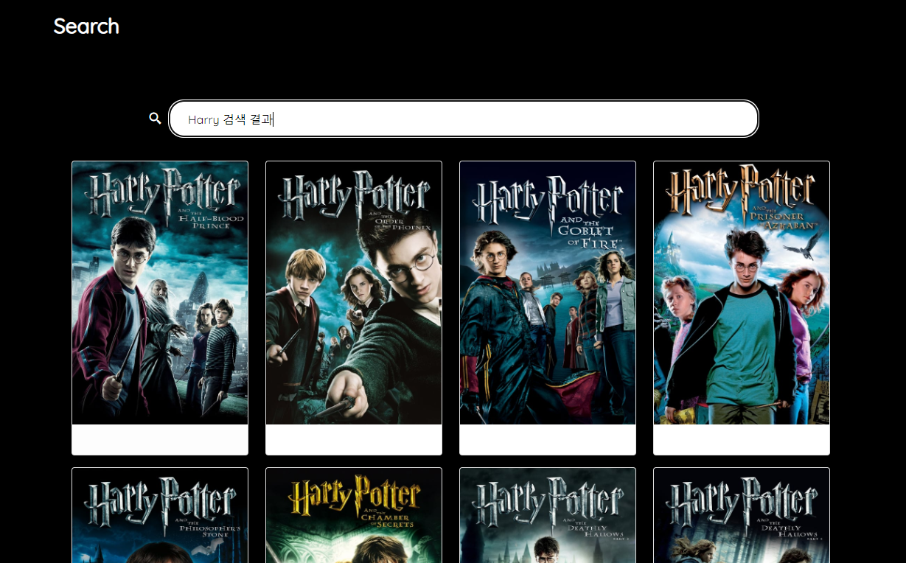
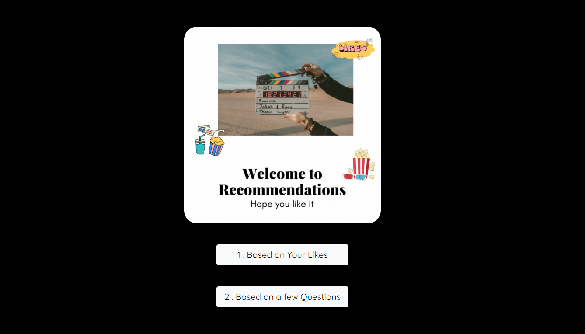
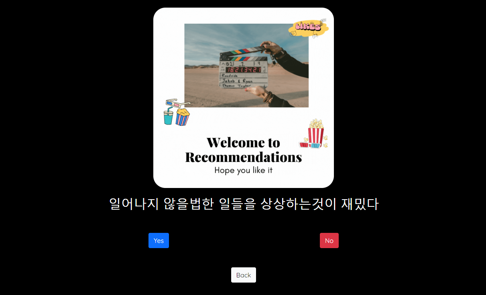
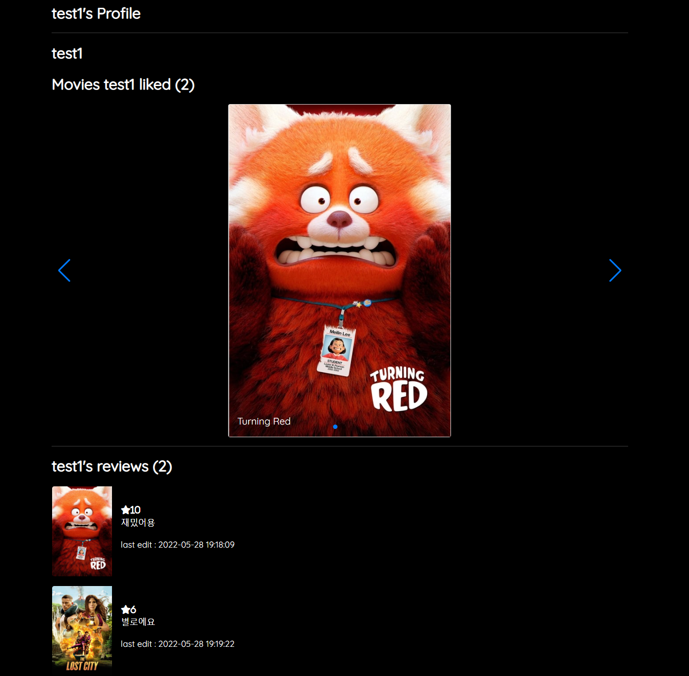

# SAFFY 1학기 최종 프로젝트 - EURACHACHA(2022-05-20~2022-05-26)

## 1.:ledger: PJT summary

- 팀명: DH96s - 둘 다 이름의 이니셜이 DH이고, 96년생이다
- 프로젝트명: EURACHACAH - WATCHA에서 네이밍 영감을 얻었다
- 주제: 추천 알고리즘을 적용한 영화 커뮤니티 사이트
- 기간: 05.20(금) ~ 05.26 (목)
- 발표: 05.27 (금, 종강식날)
- 조원: 김도현[[깃헙](https://github.com/MoCCo329/fresh-tomatoes-vue)] FE, CSS styling, 이동환[[깃헙](https://github.com/onghwand/fresh-tomatoes-django)] BE, CSS styling
- 사용기술스택:
  - 협업, 버전관리 :    
  - 언어 :    
  - FE/BE framework :  
  - DB : 
  - 배포 :  
  - 디자인 :   

## :handshake: 2. Github Conventions

- 브렌치 명을 어떻게 할까?
  - master: 운영 서버로 배포하기 위한 브랜치
  - django: 백엔드를 개발하는 브랜치
  - vue: 프론트엔드를 개발하는 브랜치

- BUT FE파일과 BE파일을 따로 관리하는것이 더 용이하겠다고 생각되어 3일차부턴 repository를 분기했고, 위 브렌치 명은 쓰지 않게 됐다.

 

- Commit Convention

  - Fix : 잘못된 동작을 고칠 때

    > Fix typo in Home.vue

  - Add : 새로운 것을 추가할 때

    > Add Detail.vue

  - Remove : 삭제가 있을 때

    > Remove Detail.vue

  - Update : 정상적으로 동작하는 파일을 보완하는 경우

    > Update login logic to accounts.js

## 3. :dolphin: DB

- ERD

- 데이터 수집 및 가공
  - 데이터출처: kaggle이라는 사이트에서 tmbd 영화 데이터 약 5천개를 CSV파일로 받아 json으로 변환
  - 가공: 원하는 필드값이 부족한 결측치, 이상치를 제거하고 총 4771개를 sqlite3에 넣어 dump

## 4. :file_cabinet: Components

- Component Schema
  - Articles : 영화에 대한 게시물을 작성, 수정, 삭제, 읽기 기능, 게시물에 대한 댓글 작성, 수정, 삭제, 읽기 기능
  - Movies : 현재 상영중인 영화, 인기 영화, 개봉 예정 영화, 각 영화에 대한 세부 정보, 리뷰 작성, 수정, 삭제 기능
  - Search : 검색어로 관련된 영화 정보 검색 기능
  - Recommendation : 사용자의 취향을 반영한 영화 추천 기능
  - Accounts : 회원가입, 로그인, 로그아웃 기능

## 5. :thumbsup: Recommendations

- 같은 취향의 유저: 사용자와 비슷한 영화들에 좋아요를 누른 유저를 찾아 해당 인원이 좋아요 누른 다른 영화를 추천한다.
  - 구현 방식: BE를 통해서만 계산된다.
    - 사용자가 좋아요 누른 영화들과 교집합이 가장 큰 다른 유저를 search.
    - 찾은 유저가 좋아요 누른 다른 영화를 추천한다.

- 다섯고개: 몇가지 질문을 통해 사용자의 취향을 파악하여 영화 추천
  - 구현 방식 : 한번 추천에 약 5개의 질문, 같은 질문을 반복한다고 덜 느끼도록 하는것이 목표.
    - FE에서 영화 DB field별로 질문들을 던진다. 질문field별로 컴포넌트가 존재하며, 랜덤으로 질문 컴포넌트를 표시한다.
    - 컴포넌트 안에서도 랜덤으로 질문을 하여 원하는 답을 얻으면 부모로 답변값과 질문 컴포넌트 변환요청을 EMIT.
    - 답변들을 모두 수집하면 BE로 전송, BE에서 알맞게 필터링하여 값을 만족하는 영화들을 응답한다.

## 6. :gear: Data Flow(Search 기능 예시)

- 프로젝트 규모상 계속해서 관리되는 영화정보 DB를 만들기 어렵기 때문에, TMDB 영화정보 API를 통해 이 문제를 해결한다.

  BE에서 경우에 따라 TMDB API에 요청을 보내고, 해당 영화정보가 DB에 없는지 파악한 뒤, 없다면 DB에 데이터를 추가하여 DB를 관리한다.

## 7. :film_strip: 결과 및 배포

- Home

  

- Movie Detail

  

- Search

  

- Recommendations

  

  

  

- Article

  

  

- Profile

  

## 8. 느낀점 및 디테일

- 간단한 웹 페이지를 만드는데도 많은 노력과 다양한 기술들이 필요하다는 것을 가장 크게 느꼈다. 처음으로 진행한 프로젝트다 보니 무엇부터 시작하고, 어떤식으로 팀원과 역할을 분담할지도 어색했지만 프로젝트를 수행하면서 다음에는 어떤식으로 진행하는게 좋을지 직접 체감하며 배우게된 것 같다. 예를들면, FE와 BE를 연결하는 ULR을 정하고, 데이터베이스의 ERD를 짜고, 기능에 따른 컴포넌트 구조를 먼저 짜놓는것이 프로젝트를 진행하는데 주요하다는것을 알게 되었다. 또한 세부 내용별 구현 순서를 계획하고, 칸반보드나 개발일지를 작성하면 프로젝트에 대한 진행사항을 파악하기 쉬우며 그만큼 역할분담이나 시간안배에 용이하다고 느꼈다. 

  기한이 정해져 있는 프로젝트이기에 원하는 목표를 계속해서 수정하고, 우선순위에 따라 작업을 하는것이 프로젝트 완료에 중요했다. 처음엔 이것저것 해보려는 욕심이 있었지만, 쉬워보이던 부분에서도 에러가 발생하고, 또 이를 디버깅하다보면 많은 시간이 소요된다는 것을 깨달았다. 디버깅하고, 모르던 내용을 익혀 적용하려면 여러 키워드로 검색을 하는 요령과 공식 문서들을 끈기있게 읽는게 큰 도움이 되었다.

  이처럼 한 학기의 마무리이자 마지막 프로젝트를 진행하며 배운것이 많았고, 좋은 팀원과 함께 소박하지만 나름 팀의 개성이 들어간 왭사이트가 탄생했다는 것에 큰 뿌듯함을 느끼며, 차후 프로젝트는 더 체계적이고 완성도 있게 만들 수 있을것 같다.

- [DETAIL.md](./DETAIL.md)