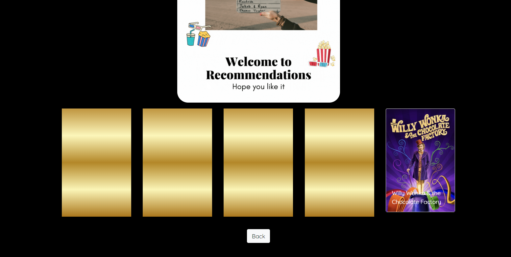
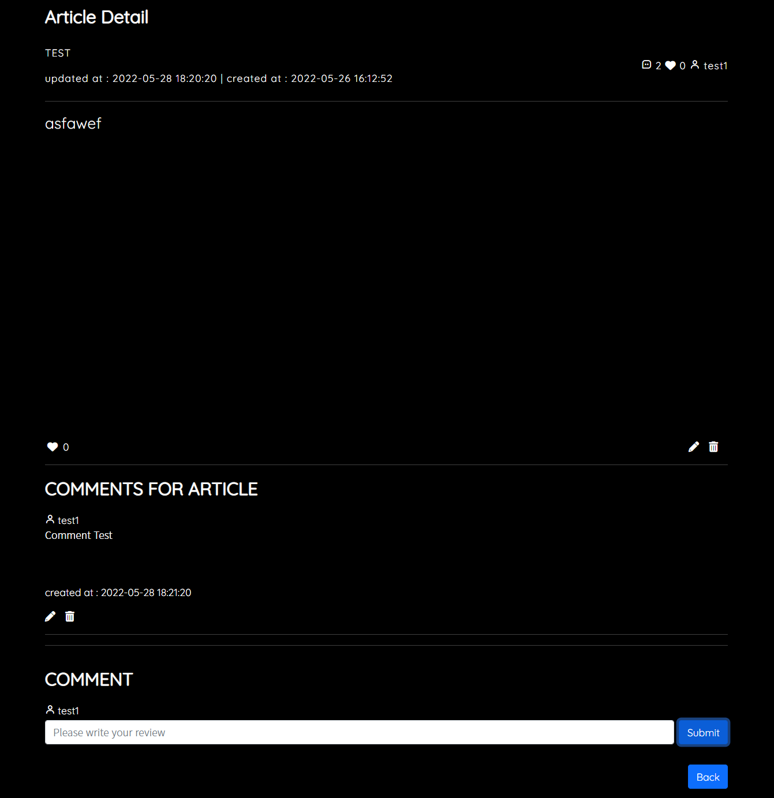

# SAFFY 1학기 최종 프로젝트 - EURACHACHA(2022-05-20~2022-05-26)

## 1.:ledger: PJT summary

- 팀명: DH96s - 둘 다 이름의 이니셜이 DH이고, 96년생이다
- 프로젝트명: EURACHACAH - WATCHA에서 네이밍 영감을 얻었다
- 주제: 추천 알고리즘을 적용한 영화 커뮤니티 사이트
- 기간: 05.20(금) ~ 05.26 (목)
- 발표: 05.27 (금, 종강식날)
- 조원: 김도현 FE, CSS styling([깃헙](https://github.com/MoCCo329)), 이동환 BE, CSS styling([깃헙](https://github.com/onghwand))
- 사용기술스택:
  - 협업, 버전관리 :    
  - 언어 :    
  - FE/BE framework :  
  - DB : 
  - 배포 :  
  - 디자인 :   

## :lemon: 2. Github Conventions

- 브렌치 명을 어떻게 할까?
  - master: 운영 서버로 배포하기 위한 브랜치
  - django: 백엔드를 개발하는 브랜치
  - vue: 프론트엔드를 개발하는 브랜치

- BUT FE파일과 BE파일을 따로 관리하는것이 더 용이하겠다고 생각되어 3일차부턴 repository를 분기했고, 위 브렌치 명은 쓰지 않게 됐다.

 

- Commit Convention

  - Fix : 잘못된 동작을 고칠 때

    > Fix typo in Home.vue

  - Add : 새로운 것을 추가할 때

    > Add Detail.vue

  - Remove : 삭제가 있을 때

    > Remove Detail.vue

  - Update : 정상적으로 동작하는 파일을 보완하는 경우

    > Update login logic to accounts.js

## 3. :dolphin: DB

- ERD

- 데이터 수집 및 가공
  - 데이터출처: kaggle이라는 사이트에서 tmbd 영화 데이터 약 5천개를 CSV파일로 받아 json으로 변환
  - 가공: 원하는 필드값이 부족한 결측치, 이상치를 제거하고 총 4771개를 sqlite3에 넣어 dump

## 4. :scroll: Components

- Component Schema

## 5. :thumbsup: Recommendations

- 같은 취향의 유저: 사용자와 비슷한 영화들에 좋아요를 누른 유저를 찾아 해당 인원이 좋아요 누른 다른 영화를 추천한다.
  - 구현 방식: BE를 통해서만 계산된다.
    - 사용자가 좋아요 누른 영화들과 교집합이 가장 큰 다른 유저를 search.
    - 찾은 유저가 좋아요 누른 다른 영화를 추천한다.

- 다섯고개: 몇가지 질문을 통해 사용자의 취향을 파악하여 영화 추천
  - 구현 방식 : 한번 추천에 약 5개의 질문, 같은 질문을 반복한다고 덜 느끼도록 하는것이 목표.
    - FE에서 영화 DB field별로 질문들을 던진다. 질문field별로 컴포넌트가 존재하며, 랜덤으로 질문 컴포넌트를 표시한다.
    - 컴포넌트 안에서도 랜덤으로 질문을 하여 원하는 답을 얻으면 부모로 답변값과 질문 컴포넌트 변환요청을 EMIT.
    - 답변들을 모두 수집하면 BE로 전송, BE에서 알맞게 필터링하여 값을 만족하는 영화들을 응답한다.

## 6. Data Flow(Search 기능 예시)

- 프로젝트 규모상 계속해서 관리되는 영화정보 DB를 만들기 어렵기 때문에, TMDB 영화정보 API를 통해 이 문제를 해결한다.

  BE에서 경우에 따라 TMDB API에 요청을 보내고, 해당 영화정보가 DB에 없는지 파악한 뒤, 없다면 DB에 데이터를 추가하여 DB를 관리한다.

## 7. 결과 및 배포

- Home

  

- Movie Detail

  

- Search

  

- Recommendations

  

  

  

  

  

- Profile

  